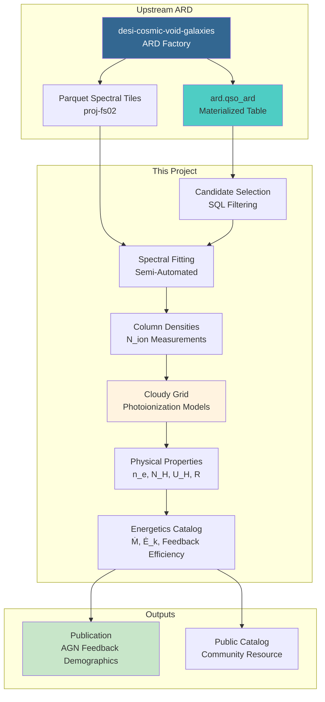

<!--
---
title: "DESI Quasar Outflows"
description: "AGN feedback and outflow energetics from DESI DR1 QSO spectra"
author: "VintageDon"
date: "2025-12-29"
version: "2.0"
status: "Skeletal"
tags:
  - type: project-root
  - domain: [ard-consumer, agn-feedback, outflow-physics]
  - tech: [python, postgresql, cloudy, desi]
related_documents:
  - "[DESI Cosmic Void Galaxies (ARD Provider)](https://github.com/radioastronomyio/desi-cosmic-void-galaxies)"
  - "[QSO Anomaly Detection](https://github.com/radioastronomyio/desi-qso-anomaly-detection)"
---
-->

# 💨 DESI Quasar Outflows

[](https://data.desi.lbl.gov/doc/releases/dr1/)
[](https://www.postgresql.org/)
[](https://www.python.org/)
[](https://gitlab.nublado.org/cloudy/cloudy/-/wikis/home)
[](LICENSE)
[]()

> Systematic measurement of quasar outflow energetics and AGN feedback significance using DESI DR1 spectroscopy and photoionization modeling.

This project consumes the Analysis-Ready Dataset (ARD) built by [desi-cosmic-void-galaxies](https://github.com/radioastronomyio/desi-cosmic-void-galaxies) to perform large-scale measurement of physical properties in quasar-driven outflows. Through semi-automated spectral fitting and Cloudy photoionization modeling, the goal is to create the first comprehensive catalog of outflow energetics for thousands of DESI quasars.

**Current Status**: Skeletal — repository structure established, awaiting ARD completion (Phase 05-06 in upstream project).

---

## 🔭 Background

This section provides context for those less familiar with AGN feedback physics. If you already know BAL quasars and outflow energetics, skip to [Data Dependencies](#-data-dependencies).

### What Are Quasar Outflows?

Quasars are extremely luminous active galactic nuclei (AGN) powered by supermassive black holes accreting material. The intense radiation can drive powerful winds — outflows of gas moving at thousands of kilometers per second away from the central engine.

These outflows manifest as blueshifted absorption features in quasar spectra. Broad Absorption Line (BAL) quasars show the most dramatic signatures: wide absorption troughs from ions like CIV, SiIV, and MgII displaced blueward of the quasar's systemic redshift.

### Why Do Outflows Matter?

AGN feedback is one of the most significant unsolved problems in galaxy evolution. Simulations require some mechanism to shut off star formation in massive galaxies — otherwise models overproduce bright galaxies relative to observations. Quasar-driven outflows are a leading candidate for this feedback mechanism.

The key question: **Are these outflows energetic enough to actually affect their host galaxies?**

Answering this requires measuring:

- **Distance (R)**: How far from the black hole does the outflow extend?
- **Mass outflow rate (Ṁ)**: How much material is being expelled?
- **Kinetic luminosity (Ė_k)**: What's the mechanical power of the wind?
- **Feedback efficiency (Ė_k/L_bol)**: Is this sufficient to impact galaxy evolution?

These quantities cannot be read directly from spectra — they require photoionization modeling to convert observed column densities into physical conditions.

### The DESI Opportunity

DESI DR1 provides ~1.6 million QSO spectra with uniform quality. The CIV and MgII absorber Value-Added Catalogs pre-identify systems with outflow signatures, reducing the search space from millions to tens of thousands of promising candidates. Combined with systematic Cloudy modeling, this enables the first population-level study of AGN feedback demographics.

---

## 📦 Data Dependencies

This project is an **ARD consumer** — it does not perform primary data ingestion. All catalog data comes from the upstream ARD factory.

### Upstream Provider

| Source | Repository | What We Use |
|--------|------------|-------------|
| DESI DR1 ARD | [desi-cosmic-void-galaxies](https://github.com/radioastronomyio/desi-cosmic-void-galaxies) | Materialized QSO catalog with VAC joins |

### Required VACs (Ingested Upstream)

| VAC | Key Columns | Purpose |
|-----|-------------|---------|
| AGN/QSO Summary | Z_SYS, BAL_PROB, AI_INDEX, BI_INDEX | Systemic redshift, BAL identification |
| CIV Absorber | CIV_NC, CIV_EW, CIV_VABS | High-ionization outflow tracers |
| MgII Absorber | MGII_NC, MGII_EW | Low-ionization diagnostics |
| BHMass | LOG_MBH, L_BOL | Black hole mass, bolometric luminosity |
| FastSpecFit | Emission lines, VDISP | Spectral properties |

### Spectral Data

| Asset | Location | Purpose |
|-------|----------|---------|
| QSO Parquet tiles | proj-fs02 network share | Raw spectra for fitting |
| Linkage index | PostgreSQL (proj-pg01) | TARGETID → tile mapping |

---

## 🔬 Methodology Overview

The analysis follows a four-phase workflow, beginning after ARD completion.

### Phase 1: Candidate Selection

SQL-based filtering of the ARD to identify outflow candidates:

- Blueshifted absorption systems (z_abs < z_sys)
- BAL probability thresholds
- Diagnostic ion availability (CIV, SiII, SiII*)

### Phase 2: Semi-Automated Spectral Fitting

For each candidate system:

- Local continuum modeling adjacent to absorption features
- Column density derivation via Apparent Optical Depth (AOD) method
- Human-in-loop validation for quality control

### Phase 3: Photoionization Modeling

Cloudy grid simulations to derive physical conditions:

- Parameter space: log(N_H) = 19-23 cm⁻², log(U_H) = -4 to -1
- χ² optimization matching observed ionic ratios
- Parallelized execution across cluster nodes

### Phase 4: Energetics Derivation

From Cloudy best-fit models:

- Distance: R = √(Q_H / 4πU_H n_H c)
- Mass outflow rate: Ṁ = Ω × 4πR × N_H × μm_p × v_out
- Kinetic luminosity: Ė_k = ½Ṁv²
- Feedback efficiency: Ė_k / L_bol

---

## 🏗️ Architecture



---

## 🚀 Project Status

| Phase | Name | Status | Blocker |
|-------|------|--------|---------|
| — | Repository Setup | ✅ Complete | — |
| — | ARD Dependency | ⏳ Waiting | Upstream Phase 05-06 |
| 01 | Candidate Selection | ⬜ Not Started | ARD completion |
| 02 | Spectral Fitting | ⬜ Not Started | Phase 01 |
| 03 | Cloudy Modeling | ⬜ Not Started | Phase 02 |
| 04 | Energetics Catalog | ⬜ Not Started | Phase 03 |

### Prerequisites

Before work begins on this project:

1. **ARD Phase 05** (VAC ETL Sprint) must complete — ingests CIV, MgII, BHMass, AGN VACs
2. **ARD Phase 06** (Validation) must certify the QSO ARD table
3. Cross-match linkage index must be built for spectral tile access

---

## 📁 Repository Structure

```markdown
desi-quasar-outflows/
├── 📚 docs/                          # Documentation
│   ├── data-science-infrastructure.md
│   └── documentation-standards/
├── 🔬 src/                           # Source code (to be developed)
├── 🚀 scripts/                       # Analysis pipelines (to be developed)
├── ⚙️ config/                        # Cloudy parameters, config templates
├── 📊 notebooks/                     # Analysis notebooks (to be developed)
├── 🧪 tests/                         # Unit tests (to be developed)
├── 💾 data/                          # Local data cache (gitignored)
├── 🗒️ scratch/                       # Session checkpoints
└── 📝 README.md                      # This file
```

---

## 🖥️ Infrastructure

This project runs on the [Proxmox Astronomy Lab](https://github.com/radioastronomyio/proxmox-astronomy-lab) cluster.

| Resource | Node | Purpose |
|----------|------|---------|
| PostgreSQL 16 | proj-pg01 | ARD queries, candidate selection |
| Spectral tiles | proj-fs02 | QSO spectra (Parquet format) |
| Cloudy compute | proj-dp01 | Photoionization grid execution |
| GPU (optional) | radio-gpu01 | Accelerated fitting if needed |

---

## 🔗 Related Projects

### DESI Research Portfolio

| Project | Role | Status |
|---------|------|--------|
| [desi-cosmic-void-galaxies](https://github.com/radioastronomyio/desi-cosmic-void-galaxies) | ARD provider (upstream) | Active |
| This repo | Outflow energetics (consumer) | Skeletal |
| [desi-qso-anomaly-detection](https://github.com/radioastronomyio/desi-qso-anomaly-detection) | ML anomaly detection (consumer) | Skeletal |

### External Resources

| Resource | Description |
|----------|-------------|
| [DESI DR1 Portal](https://data.desi.lbl.gov/doc/releases/dr1/) | Official data documentation |
| [Cloudy](https://gitlab.nublado.org/cloudy/cloudy/-/wikis/home) | Photoionization modeling code |
| [CIV Absorber VAC](https://data.desi.lbl.gov/doc/releases/dr1/vac/civ-absorber/) | Upstream catalog documentation |

---

## 📜 License

This project is licensed under the MIT License — see [LICENSE](LICENSE) for details.

---

## 🙏 Acknowledgments

- [DESI Collaboration](https://www.desi.lbl.gov/) — Data Release 1 public data
- CIV/MgII Absorber VAC teams — Pre-identified outflow candidates
- Cloudy development team — Photoionization modeling framework

---

Last Updated: December 29, 2025 | Status: Skeletal (Awaiting ARD)
